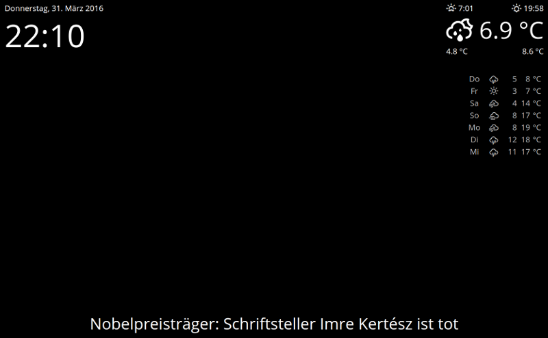

# MaglSmartMirror

Neither it's smart, nor it's a mirror :)

THIS PROJECT IS IN AN EARLY STATE, NOT SURE, IF IT WILL BE MAINTAINED.

## Features

* configurable options and customizable templates
* modular layout
* a clock
* the date
* current weather using [OpenWeatherMap API](http://openweathermap.org/api) - you need to get an api key for this
* weather forecast using [OpenWeatherMap API](http://openweathermap.org/api) - you need to get an api key for this
* top news from [Spiegel ONLINE](http://www.spiegel.de/)
* voice recognition
  * "news" - plays the latest clip of the [Tagesschau in 100 Sekunden](http://www.tagesschau.de/100sekunden/index.html)
  * "radio" - plays HR3 - http://www.hr3.de/
  * "stop" - should stop audio and video


## Installation

### Install dependencies

```
bower install
```

### Configuration

Copy or rename `public/js/config.dist.json` to `public/js/config.json` and adjust it to your needs.

### Run

Just run the `index.html` file or setup your web server to point to the `public/` folder.


## Example

